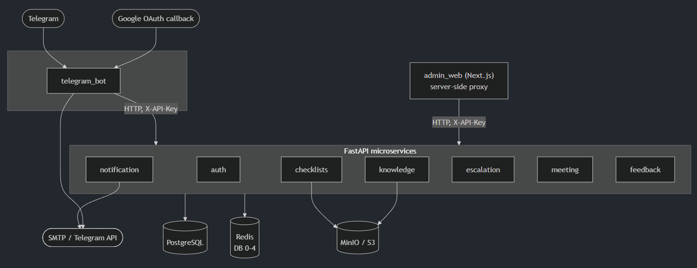

# Mentor Bot


[](https://github.com/Roman-Andr/mentor-bot/actions/workflows/build-and-push.yml)

A microservices platform for managing mentoring relationships between employees and new hires. Includes a Telegram bot for day-to-day interactions and a Next.js admin dashboard for HR / team leads.

- **Backend:** 8 FastAPI services (`Python 3.14`, `async SQLAlchemy 2.0`, `uv`)
- **Bot:** `aiogram 3` (Telegram) with Google OAuth callback
- **Frontend:** `Next.js 16` (`React 19`, `next-intl`, `Tailwind 4`, `shadcn/ui`) built with Bun
- **Infra:** `PostgreSQL 18`, `Redis 8`, `MinIO` (S3-compatible), `Mox` (mail server), `pgAdmin`, `RedisInsight`
- **Orchestration:** `Docker Compose` (dev + prod), `GitHub Actions` (CI + image publish)

---

## Table of contents

- [Architecture](#architecture)
- [Quickstart (local dev)](#quickstart-local-dev)
- [Environment variables](#environment-variables)
- [Services and ports](#services-and-ports)
- [Development workflows](#development-workflows)
- [Database and migrations](#database-and-migrations)
- [Testing and coverage](#testing-and-coverage)
- [Production deployment](#production-deployment)
- [CI/CD (GitHub Actions)](#cicd-github-actions)
- [Troubleshooting](#troubleshooting)
- [Repository layout](#repository-layout)
- [License](#license)

---

## Architecture

Eight FastAPI services + one Next.js admin dashboard communicate over a shared Docker network. Each service owns its data (dedicated PostgreSQL database per service, its own Redis DB).



### Key design points

- **Async-first:** All DB I/O uses SQLAlchemy 2.0 async with `asyncpg`.
- **Inter-service auth:** Services authenticate each other with a shared `SERVICE_API_KEY` header.
- **Redis databases:** Each service owns a dedicated Redis DB (auth=0, checklists=1, knowledge=2, telegram=3, meeting=4).
- **DB-per-service:** Each service has its own PostgreSQL database (auth_db, checklists_db, knowledge_db, notification_db, escalation_db, meeting_db, feedback_db, telegram_db, admin_web_db). Databases are created automatically on first start via init script.
- **Rate limiting:** `slowapi` on public API routes.
- **Dependency management:** `uv` for Python services, Bun for admin web.
- **Docker builds:** Single parameterized `Dockerfile` with `SERVICE_NAME` build arg shared across all Python services; admin web has its own `admin_web/Dockerfile`.

### Services

| Service               | Port (host) | Responsibility                                                           |
| --------------------- | ----------- | ------------------------------------------------------------------------ |
| `auth_service`        | 8001        | Users, departments, mentor↔mentee relationships, JWT auth, invitations   |
| `checklists_service`  | 8002        | Onboarding task templates and per-user progress tracking                 |
| `knowledge_service`   | 8003        | KB articles, categories, tags, file uploads, Q&A dialogues               |
| `notification_service`| 8004        | Telegram + SMTP notifications, scheduled alerts                          |
| `escalation_service`  | 8005        | Escalation workflow and status tracking                                  |
| `meeting_service`     | 8006        | Meeting scheduling with Google Calendar                                  |
| `feedback_service`    | 8007        | Feedback collection                                                      |
| `telegram_bot`        | 5670        | Telegram interface (aiogram 3) + Google OAuth callback                   |
| `admin_web`           | 3000        | Next.js admin dashboard (i18n: en / ru)                                  |
| `mox`                 | 8025        | Mail server (SMTP/IMAP) for romanandr.ru                                 |

Infra ports: PostgreSQL `5432`, Redis `6379`, pgAdmin `5050`, RedisInsight `5540`, MinIO S3 `9000` / console `9001`, Mox SMTP `25` / SMTPS `465` / submission `587` / IMAPS `993`.

### Service internal layout

Every Python service follows the same structure:

```bash
service_name/
  service_name/
    main.py        # FastAPI app + lifespan hooks
    config.py      # Pydantic settings (reads from .env)
    api/           # Route handlers
    models/        # SQLAlchemy 2.0 async ORM models
    repositories/  # Data access layer
    schemas/       # Pydantic request/response schemas
    services/      # Business logic
    database/      # DB init / session management
    utils/         # Caching helpers, misc
  migrations/      # Alembic migrations (when applicable)
  tests/
  pyproject.toml
  uv.lock
```

---

## Quickstart (local dev)

### Prerequisites

- Docker + Docker Compose (v2)
- `make` (optional, but all commands assume it)
- For local frontend dev: [Bun](https://bun.sh/)
- For local Python dev: [uv](https://docs.astral.sh/uv/)

### 1. Clone and configure

```bash
git clone https://github.com/Roman-Andr/mentor-bot.git
cd mentor-bot
cp .env.example .env
```

Edit `.env` and set at minimum:

- `POSTGRES_PASSWORD` — any value for local dev
- `TELEGRAM_BOT_TOKEN` — from [@BotFather](https://t.me/BotFather)
- `TELEGRAM_BOT_USERNAME` — the bot's @username
- `SERVICE_API_KEY` — any string; shared between services
- `GOOGLE_CLIENT_ID` / `GOOGLE_CLIENT_SECRET` — only if you need Google Calendar / OAuth
- `SMTP_*` — only if you need email notifications

### 2. Start the stack

```bash
make start          # docker compose up -d --build
make status         # verify all containers are healthy
make logs           # tail logs for all services
```

First boot takes ~1–2 min: Postgres initializes, services run migrations via the entrypoint, MinIO warms up.

### 3. Load mock data (optional)

```bash
make mock-data      # requires services to be running; see scripts/setup_mock_data.py
# or start fresh with mock data:
make full-reboot    # reset-db + start + mock-data
```

### 4. Access the apps

- Admin dashboard: <http://localhost:3000>
- Telegram bot: open your bot in Telegram
- pgAdmin: <http://localhost:5050>
- RedisInsight: <http://localhost:5540>
- MinIO console: <http://localhost:9001> (root creds from `.env`)
- Mox admin: <http://localhost:8025> (mail server for romanandr.ru)
- Mox mailbox: <http://localhost:8025/mailbox>
- Service health: `http://localhost:8001/health` … `8007/health`

---

## Environment variables

Copy `.env.example` → `.env`. Highlights:

### Required

| Variable                  | Purpose                                                    |
| ------------------------- | ---------------------------------------------------------- |
| `POSTGRES_USER`           | DB user (default `postgres`)                               |
| `POSTGRES_PASSWORD`       | DB password                                                |
| `REDIS_URL`               | e.g. `redis://redis:6379`                                  |
| `TELEGRAM_BOT_TOKEN`      | From BotFather                                             |
| `TELEGRAM_BOT_USERNAME`   | Bot @username (no `@`)                                     |
| `TELEGRAM_API_KEY`        | Token used by services to call the bot                     |
| `SERVICE_API_KEY`         | Shared secret for inter-service calls                      |

### Google OAuth (meeting / telegram)

| Variable               | Purpose                                                              |
| ---------------------- | -------------------------------------------------------------------- |
| `GOOGLE_CLIENT_ID`     | OAuth 2.0 client ID                                                  |
| `GOOGLE_CLIENT_SECRET` | OAuth 2.0 secret                                                     |
| `GOOGLE_REDIRECT_URI`  | e.g. `http://localhost:5670/auth/google/callback` (dev)              |

### SMTP (email notifications)

`SMTP_HOST`, `SMTP_PORT`, `SMTP_USER`, `SMTP_PASSWORD`, `SMTP_USE_TLS`, `DEFAULT_FROM_EMAIL`.

### S3 / MinIO

`S3_ENDPOINT`, `S3_ACCESS_KEY`, `S3_SECRET_KEY`, `S3_REGION`, `S3_USE_SSL`, `S3_SECURE_MODE`, `S3_PRESIGNED_URL_EXPIRY`, `MINIO_ROOT_USER`, `MINIO_ROOT_PASSWORD`, `KNOWLEDGE_S3_BUCKET`, `CHECKLISTS_S3_BUCKET`.

### Security (set these in prod)

| Variable         | Notes                                                                   |
| ---------------- | ----------------------------------------------------------------------- |
| `CORS_ORIGINS`   | JSON array — `'["https://admin.example.com"]'` in prod                  |
| `ALLOWED_HOSTS`  | JSON array — Host header whitelist                                      |
| `SECRET_KEY`     | App secret                                                              |
| `JWT_SECRET_KEY` | JWT signing key                                                         |

### Deployment (prod `.env` only)

| Variable          | Notes                                                    |
| ----------------- | -------------------------------------------------------- |
| `DOCKER_USERNAME` | Docker Hub namespace used in image names                 |
| `IMAGE_TAG`       | Tag to deploy (git short SHA or `latest`)                |
| `REGISTRY`        | Optional, defaults to `docker.io`                        |
| `IMAGE_PREFIX`    | Optional, defaults to `mentor-bot`                       |

### Optional / defaults

`TZ=UTC`, `LOG_LEVEL=INFO`, `PGADMIN_DEFAULT_EMAIL`, `PGADMIN_DEFAULT_PASSWORD`.

---

## Services and ports

### Exposed ports (host → container)

| Purpose         | Port       |
| --------------- | ---------- |
| admin_web       | `3000`     |
| auth_service    | `8001`     |
| checklists      | `8002`     |
| knowledge       | `8003`     |
| notification    | `8004`     |
| escalation      | `8005`     |
| meeting         | `8006`     |
| feedback        | `8007`     |
| telegram_bot    | `5670`     |
| PostgreSQL      | `5432`     |
| Redis           | `6379`     |
| pgAdmin         | `5050`     |
| RedisInsight    | `5540`     |
| MinIO S3 API    | `9000`     |
| MinIO console   | `9001`     |
| Mox SMTP        | `25`       |
| Mox SMTPS       | `465`      |
| Mox submission  | `587`      |
| Mox IMAPS       | `993`      |
| Debugger ports  | `5670-5678`, `9229` (admin_web) |

Each FastAPI service exposes OpenAPI docs at `http://localhost:<port>/docs`.

### Internal service URLs (inside Docker network)

`http://auth_service:8000`, `http://checklists_service:8000`, `http://knowledge_service:8000`, etc. The admin web proxies all API calls server-side using these URLs.

---

## Development workflows

### Docker-based

```bash
make start                # Build + start everything
make stop                 # Stop all containers
make restart              # Full rebuild (down + up --build)
make full-reboot          # reset-db + start + mock-data
make status               # Container status table
make logs                 # Tail all service logs
make logs-<service>       # Tail a specific service (auth, checklist, knowledge, meeting, etc.)
make reboot-<service>     # Quick restart without rebuild
make restart-<service>    # Rebuild + restart one service
make shell-<service>      # Exec into container (bash/sh)
make prune                # Clean dangling images / volumes / build cache
make clean                # Full teardown (down -v --rmi all)
```

### Native dev (hot reload for frontend)

```bash
make dev-admin    # Spins up deps in Docker, runs `bun dev` on host
make dev-meeting  # Spins up deps in Docker, follows meeting_service logs
```

### Python per-service

```bash
cd auth_service
uv sync                          # Install deps
uv run pytest                    # Tests
uv run pytest tests/test_x.py    # Single file
uv run ruff check .              # Lint
uv run mypy .                    # Type check
uv run alembic upgrade head      # Apply migrations
```

### Admin web (Next.js)

```bash
cd admin_web
bun install
bun dev                # Dev server with Turbopack
bun build              # Production build
bun lint               # ESLint
bun run test           # Vitest (unit tests)
bun run test:watch
bun run test:coverage
```

### Dependency management

```bash
make reset-locks    # Remove + regenerate every uv.lock
make update-deps    # Check PyPI + upgrade outdated Python deps
```

### Debugging

All Python services expose a `debugpy` listener when `DEBUG=true` is set in the environment (see `docker-entrypoint.sh`). Host-mapped debug ports are defined in `docker-compose.override.yml` (telegram=5670, auth=5672, … meeting=5678). admin_web exposes `9229` for Node inspector.

---

## Database and migrations

Every data-holding service uses Alembic. The entrypoint runs `alembic upgrade head` automatically on container start; if no `alembic_version` row exists (baseline DB), it stamps `head` instead of re-creating the schema.

### Per-service commands

```bash
# Create a revision from ORM changes
make migrate-revision SERVICE=auth_service MSG="add user avatar column"

# Apply all pending migrations for one service
make migrate-upgrade SERVICE=auth_service

# Downgrade one step (or to specific revision)
make migrate-downgrade SERVICE=auth_service REV=-1

# Inspect history / current revision
make migrate-history SERVICE=auth_service
make migrate-current SERVICE=auth_service

# Stamp a revision without running it
make migrate-stamp SERVICE=auth_service REV=head
```

### All services at once

```bash
make migrate-all   # alembic upgrade head for every DB-backed service
```

### Backup / restore

```bash
make backup-db                          # Dump to backups/backup_<timestamp>.sql
make restore-db FILE=backups/foo.sql    # Restore from file
make reset-db                           # Drop volumes + build cache (destructive)
```

### Shells

```bash
make shell-postgres   # psql
make shell-redis      # redis-cli
make shell-minio
```

---

## Testing and coverage

### Run everything

```bash
make test                   # All Python services
make test-admin             # admin_web (Vitest)
make coverage               # Run all + generate unified HTML dashboard
make coverage-serve         # Re-serve existing reports at :8765
make coverage-clean
```

### Per service

```bash
cd <service> && uv run pytest
cd admin_web && bun run test
```

### CI coverage

Every push/PR against `main` runs the full Python matrix (all 8 services), plus admin web lint + tests, on GitHub Actions. See `.github/workflows/ci.yml`.

---

## Production deployment

There are two compose files:

- `docker-compose.yml` + `docker-compose.override.yml` (auto-loaded) — local dev, builds images from source, bind-mounts code.
- `docker-compose.prod.yml` — production, pulls prebuilt images from a registry, adds resource limits, binds DB/Redis/MinIO ports to `127.0.0.1` only, and rotates logs (10 MB × 3).

**Images are expected at** `docker.io/<DOCKER_USERNAME>/mentor-bot-<service>:<tag>`.

### Option A — automated (GitHub Actions → Docker Hub)

1. Add repo secrets `DOCKERHUB_USERNAME` and `DOCKERHUB_TOKEN`.
2. Push to `main` (or tag `v*`). The `Build and push images` workflow runs the test gate, then builds and pushes all 9 images to Docker Hub (`sha-<short>`, `latest`, and any branch/tag names).
3. On the VPS, follow [Deploy on VPS](#deploy-on-vps).

### Option B — manual (local → registry)

```bash
make docker-login DOCKER_USERNAME=<yourname>

# Tag = current git short SHA (override with TAG=...)
DOCKER_USERNAME=<yourname> make build-push
DOCKER_USERNAME=<yourname> TAG=v1.2.3 make build-push
```

Under the hood, `scripts/build-and-push.sh` uses `docker buildx` on `linux/amd64` and pushes both `<tag>` and `latest`.

### Deploy on VPS

#### Requirements on the VPS

- Docker + Docker Compose v2
- Port 80/443 open (and whatever reverse proxy you run)
- Logged into Docker Hub (`docker login`) for private images

#### Steps

```bash
# 1. Clone repo (you only need the compose + Makefile files, not source)
git clone https://github.com/Roman-Andr/mentor-bot.git
cd mentor-bot

# 2. Create production .env
cp .env.example .env
# Edit: real secrets, CORS_ORIGINS, ALLOWED_HOSTS, GOOGLE_REDIRECT_URI (HTTPS),
# DOCKER_USERNAME, IMAGE_TAG=<sha or latest>
# Set S3_USE_SSL=true, S3_SECURE_MODE=true if S3 endpoint is HTTPS
# Change MINIO_ROOT_PASSWORD, SERVICE_API_KEY, JWT_SECRET_KEY, SECRET_KEY, POSTGRES_PASSWORD

# 3. Pull + start
make prod-pull
make prod-up
make prod-logs       # Verify health

# One-shot pull + up
make prod-deploy TAG=<sha>
```

### Zero-downtime redeploy

```bash
IMAGE_TAG=<new_sha> docker compose -f docker-compose.prod.yml pull
IMAGE_TAG=<new_sha> docker compose -f docker-compose.prod.yml up -d
# Compose recreates only the services whose image digest changed.
```

### Stop / roll back

```bash
make prod-down
# Roll back: set IMAGE_TAG=<previous_sha> in .env, then `make prod-up`
```

### Reverse proxy

`docker-compose.prod.yml` binds admin_web to `127.0.0.1:3000`, Postgres / Redis / MinIO to `127.0.0.1` as well. Terminate TLS in front (nginx, Caddy, Traefik) and proxy to `http://127.0.0.1:3000`. Forward the telegram bot's OAuth callback (`:5670/auth/google/callback`) if you rely on it.

### Production checklist

- [ ] Rotate **all** secrets in `.env` (`SERVICE_API_KEY`, `JWT_SECRET_KEY`, `SECRET_KEY`, Postgres password, MinIO root).
- [ ] Set `CORS_ORIGINS` and `ALLOWED_HOSTS` to your real domains (no `["*"]`).
- [ ] Set `GOOGLE_REDIRECT_URI` to your public HTTPS callback URL and update it in Google Cloud Console.
- [ ] Update `TELEGRAM_BOT_TOKEN` to a production bot.
- [ ] Configure SMTP to a real provider.
- [ ] Set up automated backups: `make backup-db` via cron → off-box storage (S3, etc.).
- [ ] TLS-terminating reverse proxy in front of admin_web.
- [ ] Monitor service health endpoints (`/health`) and container `HEALTHCHECK` states.
- [ ] Set `LOG_LEVEL=INFO` or `WARNING` (not `DEBUG`).

### Resource footprint

`docker-compose.prod.yml` sets conservative limits suitable for a 2 GB VPS:

| Service    | `mem_limit` | Notes                                |
| ---------- | ----------- | ------------------------------------ |
| Python svc | 220 MB each |                                      |
| admin_web  | 350 MB      |                                      |
| Postgres   | 700 MB      | `shared_buffers=256MB`, 60 max conns |
| Redis      | 100 MB      | `maxmemory 64mb`, `allkeys-lru`      |
| MinIO      | 256 MB      |                                      |

Adjust in `docker-compose.prod.yml` per your host.

---

## CI/CD (GitHub Actions)

Located in `.github/workflows/`:

- **`ci.yml`** — runs on every PR/push to `main`. Matrix lints (`ruff`), type-checks (`mypy`, non-blocking), and tests every Python service, plus lints + tests admin_web.
- **`build-and-push.yml`** — on push to `main` or `v*` tag: re-runs the test gate, then builds + pushes every service image to Docker Hub with tags `sha-<short>`, branch/tag name, and `latest` (on `main` only). Manual runs via `workflow_dispatch` accept an extra tag.
- **`image-retention.yml`** — manual (`workflow_dispatch`) cleanup of old SHA tags on Docker Hub. Keeps `latest`, any `v*` tag, and the `N` newest SHA tags (default 5).

### Required repo secrets

- `DOCKERHUB_USERNAME`
- `DOCKERHUB_TOKEN` (Docker Hub access token with read/write/delete scope)

---

## Troubleshooting

### Container unhealthy / keeps restarting

```bash
make status
make logs-<service>
docker compose ps
```

### Migrations failing on boot

The entrypoint stamps `head` automatically if `alembic upgrade` fails on an existing schema. If you need a clean slate:

```bash
make reset-db && make start
```

### Ports already in use

Stop whatever owns the port, or remap in `docker-compose.yml` / `docker-compose.override.yml`.

### Admin web can't reach a service

Services resolve each other via Docker DNS (`http://auth_service:8000`, etc.). Verify `docker network inspect mentor-bot_mentor_network` lists all containers.

### Telegram bot not responding

Check `TELEGRAM_BOT_TOKEN`, `TELEGRAM_API_KEY`, and `make logs-telegram`. The bot uses long polling; it does not need a public webhook for dev.

### MinIO 403 / presigned URLs failing

Verify `S3_ACCESS_KEY` / `S3_SECRET_KEY` match `MINIO_ROOT_USER` / `MINIO_ROOT_PASSWORD`. In production set `S3_USE_SSL=true` and `S3_SECURE_MODE=true` when the endpoint is HTTPS.

### "alembic_version already exists" on fresh prod deploy

Expected — the entrypoint falls back to `alembic stamp head`. See `docker-entrypoint.sh`.

---

## Repository layout

```bash
mentor-bot/
├── admin_web/               # Next.js 16 admin dashboard
├── auth_service/            # Users, departments, JWT, invitations
├── checklists_service/      # Onboarding task templates + progress
├── escalation_service/      # Escalation workflow
├── feedback_service/        # Feedback collection
├── knowledge_service/       # KB articles, tags, Q&A, files
├── meeting_service/         # Meeting scheduling + Google Calendar
├── notification_service/    # Telegram + email notifications
├── telegram_bot/            # aiogram 3 bot + Google OAuth callback
│
├── docker-compose.yml           # Base compose (dev + prod source)
├── docker-compose.override.yml  # Auto-loaded in dev (bind mounts, debug ports)
├── docker-compose.prod.yml      # Standalone prod compose (pulls images)
├── Dockerfile                   # Shared Python services Dockerfile
├── docker-entrypoint.sh         # Runs migrations + starts app
├── Makefile                     # Every workflow shortcut
│
├── scripts/
│   ├── build-and-push.sh        # Build + push all images
│   ├── setup_mock_data.py       # Populate services with demo data
│   ├── aggregate_coverage.py    # Unified coverage dashboard
│   ├── serve_coverage.py
│   ├── run_tests.py
│   ├── update_deps.py
│   └── mock_data/               # JSON fixtures
│
├── .github/workflows/
│   ├── ci.yml                   # Lint + test on PR / push
│   ├── build-and-push.yml       # Build + publish images
│   └── image-retention.yml      # Prune old Docker Hub tags
│
├── .env.example
└── pyproject.toml               # Shared dev tooling (ruff, mypy, pytest)
```

---

## License

MIT. See `pyproject.toml` for author and project metadata.
